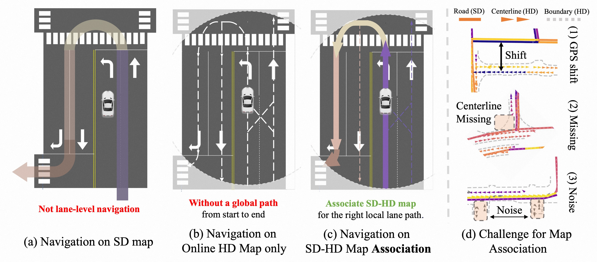

<div align="center">

  <h1 style="font-size: 32px; font-weight: bold;"> Driving by Hybrid Navigation: <br> An Online HD-SD Map Association Framework and Benchmark for Autonomous Vehicles </h1>

  <a href="https://arxiv.org/abs/2507.07487">
    
  </a>
  <a href="https://huggingface.co/datasets/wanjiaxu/OMA">
    
  </a>
  <a href="https://huggingface.co/wanjiaxu/MAT">
    
  </a>
  <a href="https://github.com/WallelWan/OMA-MAT">
    
  </a>
</div>


## Online Map Association Benchmark and Framework

Connecting online mapping with hybrid navigation to enable interpretable autonomous driving.

<p align="center">
  
</p>

**Key insights**:
- We introduce Online Map Association (OMA), the first benchmark for hybrid navigation-oriented online map association.

<p align="center">
  
</p>

- We introduce Association P-R, a metric for map association that considers the accuracy and precision of topological alignment.

<p align="center">
  
</p>

- We propose a Map Association Transformer (MAT), which utilizes path-aware attention and spatial attention mechanisms to enable understanding of geometric and topological correspondences.

<p align="center">
  
</p>


## News

- 2025/07/15: First commit.

## Quick Start

### Prepare Dataset

```
# Download the OMA dataset to the data/oma directory using the Huggingface CLI:
# Note: The dataset is still in compliance review. We will open it as soon as possilble.

huggingface-cli dataset download wanjiaxu/OMA --local-dir data/oma
```

### Training

```
# By script (Recommended)
# -p is default set as python and can be ignored
sh scripts/train.sh -p python -d oma -c oma-mt-v1m1-l -n oma-mt-v1m1-l

# Direct
export PYTHONPATH=./
python tools/train.py --config-file configs/oma/oma-mt-v1m1-l.py --options save_path=exp/oma/oma-mt-v1m1-l
```

### Test

```
# By script (Based on experiment folder created by training script)
# -p is default set as python and can be ignored
# -w is default set as model_best and can be ignored
sh scripts/test.sh -p python -d oma -n oma-mt-v1m1-l -w model_best

# Direct
export PYTHONPATH=./
python tools/test.py --config-file configs/oma/oma-mt-v1m1-l.py --options save_path=exp/oma/oma-mt-v1m1-l weight=exp/oma/oma-mt-v1m1-l/model/model_best.pth
```

## Model and Checkpoint

Coming soon, Wait for data compliance review.

## Licence

This project is released under [MIT licence](./LICENSE).

## Acknowledgment

This project is mainly based on the following projects:
- [Pointcept](https://github.com/Pointcept/Pointcept)

The Readme is inspired by [DeepEyes](https://github.com/Visual-Agent/DeepEyes).

## TODO

- [*] Improved documentation and tutorials
- [ ] Open resource the post-process code.
- [ ] Open resource the eval metric code.
- [ ] Open resource the dataset in huggingface.
- [ ] Open resource the checkpoint in huggingface.

## Citation

```
@article{wan2025driving,
  title={Driving by Hybrid Navigation: An Online HD-SD Map Association Framework and Benchmark for Autonomous Vehicles},
  author={Wan, Jiaxu and Wang, Xu and Xie, Mengwei and Chang, Xinyuan and Liu, Xinran and Pan, Zheng and Xu, Mu and Yuan, Ding},
  journal={arXiv preprint arXiv:2507.07487},
  year={2025}
}
```